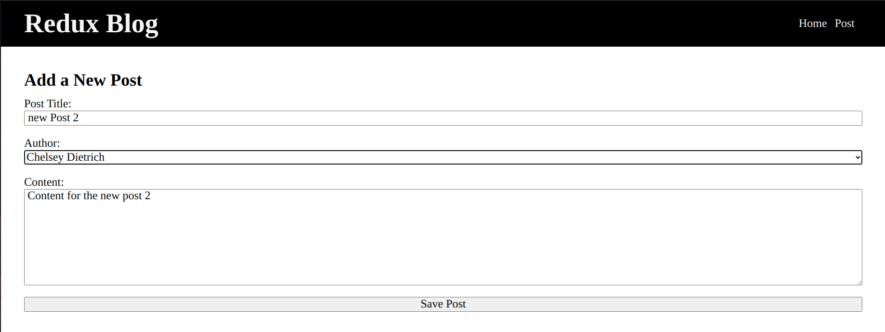
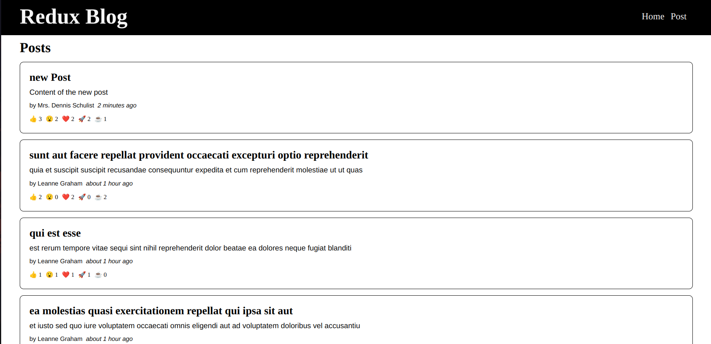

# Redux Blog

### Version
1.0.0

### Introduction

Welcome to Redux Blog! This application is focused on creating and managing blog posts using Redux and Redux Thunk. Data is fetched from the [JSONPlaceholder](https://jsonplaceholder.typicode.com/) website, and users can view, react to, and add new posts.

### Features

- **View Posts:** Fetch and display blog posts from JSONPlaceholder.
- **React to Posts:** Users can react to existing posts.
- **Add New Post:** Create and submit new blog posts.

  ### Preview
  - **Add New Post:**

  - **View Posts:**

### Technologies Used

#### Frontend

- **Framework:** React
- **State Management:** Redux with Redux Toolkit
- **HTTP Client:** Axios
- **Date Formatting:** date-fns
- **Icon Library:** Bootstrap Icons
- **Data Source:** [JSONPlaceholder](https://jsonplaceholder.typicode.com/)

### License
Copyright &copy; 2024 Pravinda Bandara. All Right Reserved  
This Project is licensed under this [MIT](LICENSE.txt)
